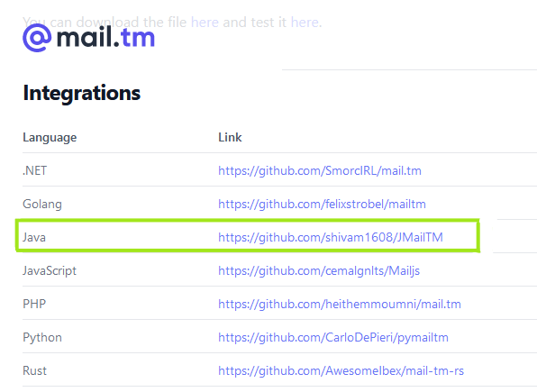

# JMailTM
JMailTM is a Lightweight Java Wrapper for https://mail.tm API (A Temp Mail Service). It has a easy to use interface and callbacks with javaDoc.

### Version : 0.8.0
### Java 8 or 8+ Required
### Special Thanks to Mail.tm Team


## Add to your projects
Easy to add in your projects using gradle, maven or jar

### Gradle
- Add it in your root build.gradle at the end of repositories:
```gradle
allprojects {
		repositories {
			maven { url 'https://jitpack.io' }
		}
	}
```
- Add the dependency (replace version with the version on top)
```gradle
dependencies {
	        implementation 'com.github.shivam1608:JMailTM:0.8.0'
	}
```

### Maven
- Add the repository in pom.xml file
```maven
	<repositories>
		<repository>
		    <id>jitpack.io</id>
		    <url>https://jitpack.io</url>
		</repository>
	</repositories>

```
- Add the dependency (replace version with the version on top)
```maven 

	<dependency>
	    <groupId>com.github.shivam1608</groupId>
	    <artifactId>JMailTM</artifactId>
	    <version>0.8.0</version>
	</dependency>


```

### Jar 
Download the jar from this repo 
```
out/artifact/JMailTM.jar or Use the Release Section
```

## Looking for JavaDoc? 
[JMailTM JavaDocs](https://shivam1608.github.io/JMailTM/)

# Ouick Start
- Open a Message Listener with a new Temp EMail

```java
import me.shivzee.JMailTM;
import me.shivzee.callbacks.EventListener;
import me.shivzee.util.JMailBuilder;
import me.shivzee.util.Message;

import javax.security.auth.login.LoginException;

public class JMailService {
    public static void main(String[] args) {
        try {
            JMailTM mailer = JMailBuilder.createDefault("randomPassword");
            mailer.init();
            System.out.println("Email : " + mailer.getSelf().getEmail());

            mailer.openEventListener(new EventListener() {
                @Override
                public void onMessageReceived(Message message) {
                    System.out.println("Message Has Attachments ?  : " + message.hasAttachments());
                    System.out.println("Message Content : " + message.getContent());
                    System.out.println("Message RawHTML : " + message.getRawHTML());
                    // To Mark Message As Read
                    message.markAsRead(status -> {
                        System.out.println("Message " + message.getId() + " Marked As Read");
                    });
                }

                @Override
                public void onError(String error) {
                    System.out.println("Some Error Occurred " + error);
                }
            });

        } catch (LoginException exception) {
            System.out.println("Exception Caught " + exception);
        }
    }

}
```
## Event Listener Interface 
- All Overridable Methods
```java
mailer.openEventListener(new EventListener() {

                @Override
                public void onReady() {}
                
                @Override
                public void onMessageReceived(Message message) {}

                @Override
                public void onMessageDelete(String id) {}

                @Override
                public void onMessageSeen(Message message) {}

                @Override
                public void onAccountDelete(Account account) {}

                @Override
                public void onError(String error) {}
            });
```

## Some Common Methods/Functions
- Get Details of Email
```java

mailer.openEventListener(new EventListener() {
                @Override
                public void onMessageReceived(Message message) {
                    String sender = message.getSenderAddress();
                    String senderName = message.getSenderName();
                    String content = message.getContent();
                    String subject = message.getSubject();
                    String id = message.getId();
                    boolean b = message.hasAttachments();
                }

                @Override
                public void onError(String error) {
                    System.out.println("Some Error Occurred "+error);
                }
            });

```
- Refer to Docs for all functions

### Some Common Implementation of Message Class Functions
```java
 message.markAsRead(status->{
     if(status) System.out.println("Message Marked as Read");
 });
message.asyncMarkAsRead(status->{
     if(status) System.out.println("Message Marked as Read");
});
 message.delete(status->{
     if(status) System.out.println("Message was Deleted");
 });
 message.asyncDelete(status->{
     if(status) System.out.println("Message was Deleted");
 });
                    
```

### Working with Attachments
```java
@Override
public void onMessageReceived(Message message) {

 if(message.hasAttachments()){
    for (Attachment attachment : message.getAttachments()){
        String filename = attachment.getFilename();
	String id = attachment.getId();
	long size = attachment.getSize();

	// Download The Attachment
	attachment.save(status->{
   		if (status) System.out.println("File Was Downloaded");
     	});
     }
    }
 }

```

### Fetching Messages (Synchronous)
- Fetch All Messages
```java

    try {
          JMailTM mailer = JMailBuilder.createDefault("randomPassword");
          mailer.init();
          System.out.println("Email : "+mailer.getSelf().getEmail());

           mailer.fetchMessages(new MessageFetchedCallback() {
              @Override
               public void onMessagesFetched(List<Message> list) {
                    for (Message message : list){
                        // All Message Functions
                    }
                }

                @Override
                public void onError(Response response) {

                }
            });

       }catch (LoginException | MessageFetchException exception){
            System.out.println("Exception Caught "+exception);
      }
     
```
- Fetch Limited Messages
```java

    try {
          JMailTM mailer = JMailBuilder.createDefault("randomPassword");
          mailer.init();
          System.out.println("Email : "+mailer.getSelf().getEmail());
	  
	  int limit = 4; // The Limit for Messages to Fetch
           mailer.fetchMessages( limit ,new MessageFetchedCallback() {
              @Override
               public void onMessagesFetched(List<Message> list) {
                    for (Message message : list){
                        // All Message Functions
                    }
                }

                @Override
                public void onError(Response response) {

                }
            });

       }catch (LoginException | MessageFetchException exception){
            System.out.println("Exception Caught "+exception);
      }
     
```

### Fetching Messages (Asynchronous)

- Fetch All Messages
```java

   try {
          JMailTM mailer = JMailBuilder.createDefault("randomPassword");
            mailer.init();
            System.out.println("Email : "+mailer.getSelf().getEmail());

            mailer.asyncFetchMessages(new MessageFetchedCallback() {
                @Override
                public void onMessagesFetched(List<Message> list) {
                    for (Message message : list){
                        // Do anything with Messages
                    }
                }

                @Override
                public void onError(Response response) {

                }
            });

        }catch (LoginException exception){
            System.out.println("Exception Caught "+exception);
       }
```
- Fetch Limited Messages
```java

   try {
          JMailTM mailer = JMailBuilder.createDefault("randomPassword");
            mailer.init();
            System.out.println("Email : "+mailer.getSelf().getEmail());
	    
	    int limit = 4; // The Limit for Messages to Fetch
            mailer.asyncFetchMessages(limit , new MessageFetchedCallback() {
                @Override
                public void onMessagesFetched(List<Message> list) {
                    for (Message message : list){
                        // Do anything with Messages
                    }
                }

                @Override
                public void onError(Response response) {

                }
            });

        }catch (LoginException exception){
            System.out.println("Exception Caught "+exception);
       }
```

### Fetch Message by ID
```java
Message message = mailer.getMessageById("ID_HERE");
```

### Create Account
- A Random Email
```java
JMailTM mailer = JMailBuilder.createDefault("randomPassword"); 
mailer.init();
```
- Custom Email and Password 
```java

//First Fetch Domain
JMailTM mailer = JMailBuilder.createAndLogin("thisismychoice@"+ Domains.getRandomDomain().getDomainName() , "MyPassword");
mailer.init();

//Can Fetch Domains by List Too (Fetches the Domains)
List<Domain> domains = Domains.fetchDomains();
    for(Domain domain : domains){
       // All Domains
}

//Can Get Saved Domains by mailer.init()
List<Domain> domainList = Domains.getDomainList();

```

### Login into an Account
```java
JMailTM mailer = JMailBuilder.login("YourEmail" , "YourPassword");
mailer.init();

```
### Delete the self logined Account
```java
mailer.delete(status->{
   if(status) System.out.println("Account was Deleted");
});
```

### Refer to JavaDocs For More Info 
[JMailTM JavaDocs](https://shivam1608.github.io/JMailTM/)

## Open Source Project 
Author : Shivzee
<br />
IDE Used : IntelliJ
<br />
[Buy me a coffee](https://buymeacoffee.com/shivzee)

### Dependencies
[GSON](https://github.com/google/gson)
<br>
[Okhttp](https://square.github.io/okhttp/)

### Old Dependencies Log
[JSONSimple](https://github.com/fangyidong/json-simple)


